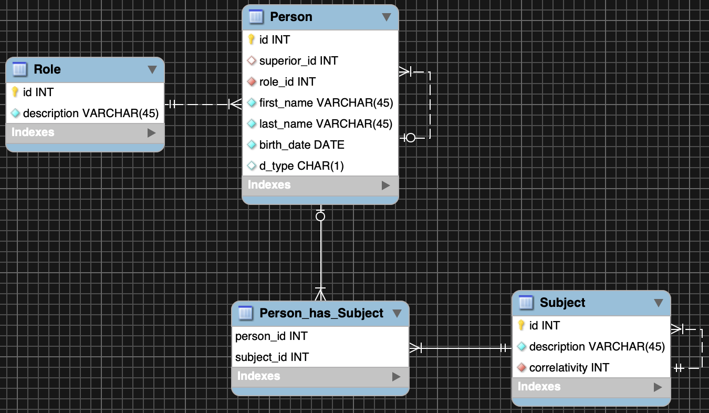
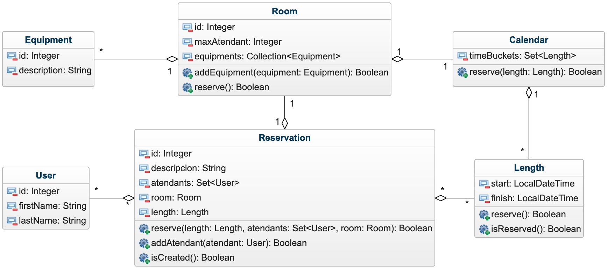
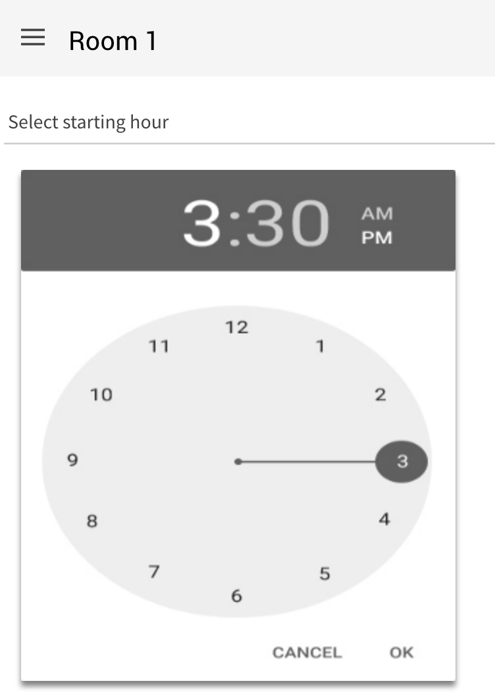
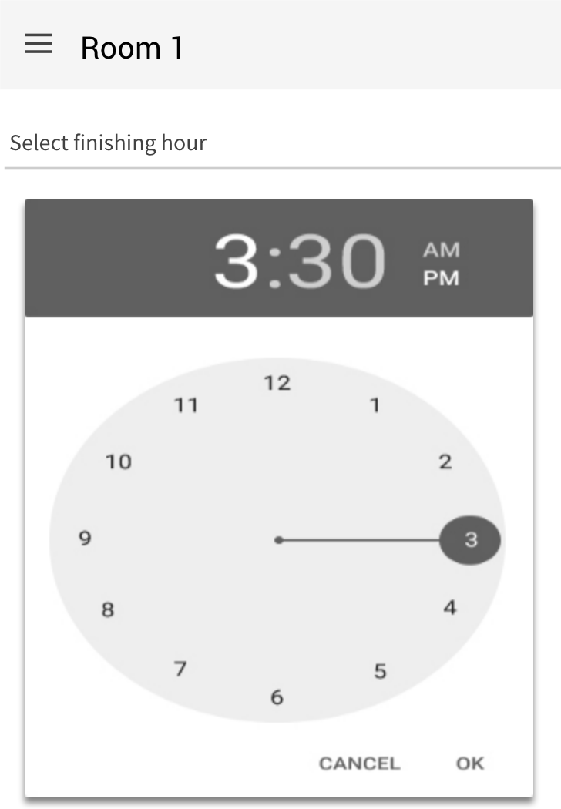
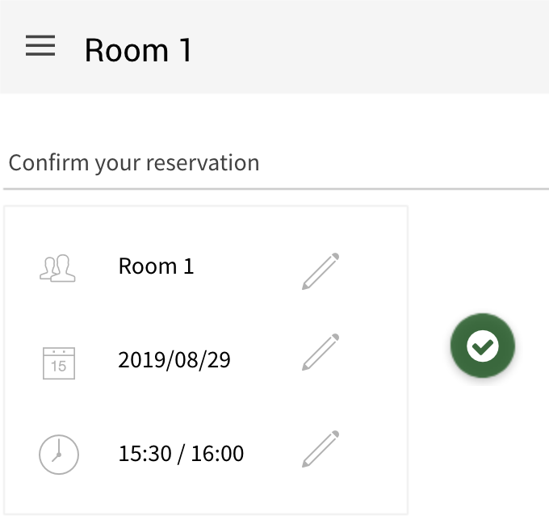
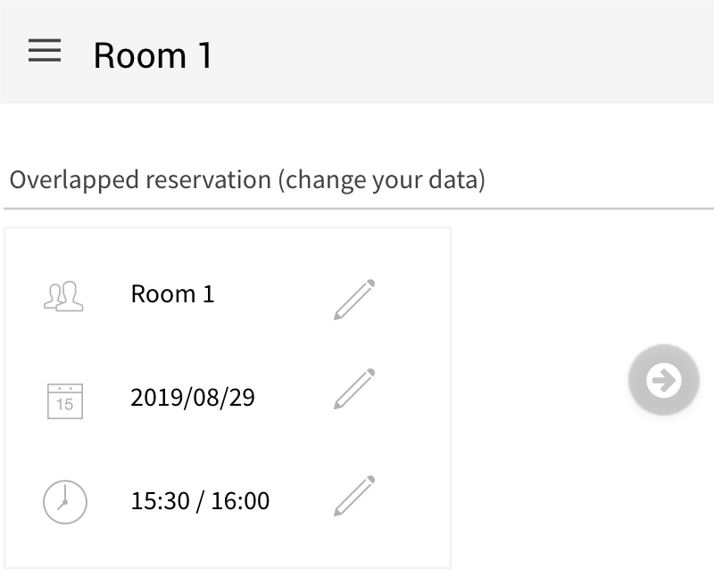

## Exercise 1

- [x] Considering the structure of a school, create the diagram that describes the domain model and relationship between entities. Some of the possible entities may be Principal, Employee, Student and Janitor. Try to apply the concepts of Hierarchy, Abstract Class and Interface.


- [x] Implement a method that returns all the students in the school grouped by the first letter of their last name.
- [x] Implement a method that returns all students taking a subject. Please consider that the students cannot be repeated, this needs to be verified.
- [x] Create at least two different database table structure diagrams to describe the possible ways that the domain could be translated to the database. Explain pros and cons of each structure.



Pros:

- It's a very simple approach to both represent the domain and solve the problem stated.
- It's normalized to a certain commonly used level (not beyond 4th normal form), thus there's no data duplication.
- The queries necessary to answer questions about the domain are kept relatively simpler. Some joins are required.

Cons:

- It can difficult the corresponding mapping to Java objects.
- It can't express the entire domain model at glance.
- This model has some indexes. This means that heavy writing or updating operations can slow down database performance.

- [x] Having the following query:

```sql
SELECT *
FROM janitor j
	INNER JOIN employee e ON e.id = j.id
	INNER JOIN person p ON p.id = j.id
WHERE j.workingArea = ‘Hallway’;
```

Our query is taking too long to respond. What changes would you do to the query and/or the database to make it go faster if we only need the first and last name of the janitor?

If the joins are not important enough, then the following query must accomplish the requested.

```sql
SELECT firstName, lastName
FROM janitor
WHERE workingArea = 'Hallway';
```

- [x] Consider that we have a query that joins many tables and takes too long to return the values. We know as a fact that the tables involved do not update too often, but we still use this query many times in a day (consider it a report). What would you do to be able to get these results faster?

I'll check the execution plan for that query to see if it can be optimized adding indexes. I also consider if it's worth saving the query's results to an intermediate table. Finally, maybe that query can be run at midnight when database traffic is minimal, so by morning we can have the results.

- [x] Using the model create a query that returns all the students with age between 19 and 21. Take into account that the age is not a column on the table, we have a field for birth date. How would you optimize this query?

```sql
SELECT *
FROM students
WHERE DATEDIFF(YEAR, birth, GETDATE()) BETWEEN 19 AND 21;
```

If performance were a problem, I'd optimize this query by making`age`a column on the table.

- [x] We need to build a new application and we want to be able to have the business logic on the database engine instead of having it in our Java code. Can you suggest a way of doing this? As an example, how would you persist a student? What are the pros and cons of this?

First of all, I extremelly discourage having the business logic on the database engine. Having said that, you can have several stored procedures with the logic.

For that example, you can have a SP that receives as params the values required to insert a new student row on a table.

Pros:

- You write the logic once and it works across all the applications connected to the database.
- (Refering to previous item) Light client apps.
- Some operations could be cached by the database engine.

Cons:

- SQL is not a programming language.
- Storing business logic is not the primary goal of a database engine.
- You are broking the correct separation of concerns. A database engine must be used only for saving items (and doing some light related tasks).
- Doing that can (and will) make the database engine become a heavy resources consumer and a system bottleneck.
- You can not make tests. In fact, you can but is extremelly difficult and sometimes is no use of doing them.
- Programmers can lose their motivation if they have to work exclusively with SQL for a long span of time.

## Exercise 2

We need to create a Conference Rooms Booking application, knowing this:

- [x] Create the domain model diagram with all the possible entities, its attributes and relationships.



- [x] Deliver diagrams of the user interface for each step of a booking process.











- [x] Considering that meetings cannot last less than 15 minutes and more than 3 hours, also meetings cannot overlap with each other in the same room, deliver the validation method that is in charge to verify these rules.

The following code is based on the class diagram created for this exercise.

This method corresponds to`Reservation`class:

```java
public boolean reserve(final Length lenght, final Set<User> atendants, final Room room) {
        final var minutesDifference = ChronoUnit.MINUTES.between(length.getStart(), length.getFinish());
        final var hoursDifference = ChronoUnit.HOURS.between(length.getStart(), length.getFinish());

        if (minutesDifference < 15 || hoursDifference > 3)
            throw new RuntimeException("Wrong time length reserved");

        return room.reserve(length);
    }
```

And this one to`Calendar`class (I did this considering the usage of`Joda`library. Particularly,`overlaps`method):

```java
public boolean reserve(final Length length) {
        final Interval newInterval = new Interval(length.getStart(), length.getFinish());
        final var overlapped = timeBuckets.stream()
                .filter(e -> new Interval(e.getStart(), e.getFinish()).overlaps(existingInterval))
        .count();
        
        if (overlapped != 0)
            return false;
        
        timeBuckets.add(length);
        return true;
    }
```

